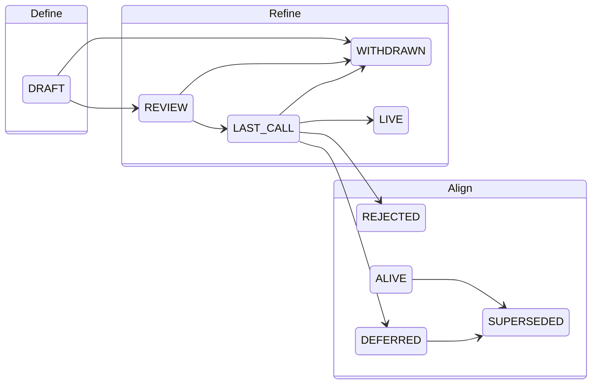

## Title
HOW Default Process

## Author(s)

zippy <eric@holochain.org>, mattyg <matt@buildyourweb.app>

## Abstract

This HOW describes a default process, format and workflow for how HOWs come into being. HOWs are the primary mechanism for proposing new features, collecting community input on an issue, and documenting decisions affecting Holochain and/or standards and processes used by Holochain hApps or by the Holochain ecosystem.  In other words, this HOW describes **how** the community comes into alignment.

## Motivation

As Holochain and the Holochain ecosystems evolves, we want a standardized process for proposing, adopting, and documenting standards of all types, including: protocol creation and changes, feature additions, and process improvements, etc. A well-defined HOW process helps:
- Maintain transparency in decision-making
- Ensure proper technical documentation
- Foster community participation
- Track the history of protocol changes
- Enable structured discussions about significant changes
- Enable coherent evolution of both Holochain itself, as well as the patterns and processes in use by the wider Holochain ecosystem.

## Rationale

This standard, as the first and the default process for adding HOWs to the HOW tree fully addresses the motivation:
- as this process is implemented in an open github repo it both maintains transparency of the decisions made and encourages public feedback and comments in the process, as well as tracks all changes made over time.
- the the HOW tree and the formal process for requirements for parts of the tree and adding to it ensures proper technical documentation as well as creates a clear method for evolving the process itself.

## Specification

### General
HOW standards are held in a git repo on github, and use a small number of Github's affordances to help with the process.  This backing-store is intended to be replaced by a Holochain app in the future.  The HOW processes and data formats consist of a tree structure that holds all types of standards for the Holochain framework and ecosystem.

### HOW Tree

Rather than using the pattern of storing and identifying standards as a long numerical list (as in RFCs or EIPs), HOWs are identified by a semantic path in a hierarchy.  This allows their relationship and types to be more readily understood.  The HOW tree is stored directly as a file hierarchy in a git repo. The HOW tree encompasses different types of standards where the type is represented as the directory structure of in the tree.  The initial structure is:

```
HOW/
├─ info/             // General guidelines or information
├─ social/
│  ├─ process/       // Changes to HOW processes or other organizational/ecosystem processes
│  │  ├─ how/        // This standard
├─ technical/
│  ├─ core/          // Changes to core Holochain protocols
│  ├─ application/   // Ecosystem and Application standards and conventions
```

All HOW standards MUST live as leaves of the tree.  The only files that MAY live at the branches in the tree are a `README.md` file describing the purpose of that part of the tree, and any other files related to that description, i.e. images, diagrams etc.

### HOW Format

HOW standards live as markdown file named `how.md` at the leaves of this directory structure.  The format of a HOW standard file consists of a markdown header and a markdown body.  The content of the header and body MUST follow a template specified by:
1.  merging the `_requirements.md` files that live at each level of the tree including and above the leaf where the HOW is being added
2.  merging in any additional body sections or headers specified by a status change in a process flow template.

The above format specification allows the templates for parts of the HOW tree to be contextually appropriate for that part of the tree.  For example, `technical/application` standards require a "Reference Implementation" section, what would not be appropriate for a `social/process` or `info` standard.

### HOW Workflow

HOWs transition through three stages: Define, Refine, & Align, each of which may have one or more statuses that formally indicate the steps in the workflow of a HOW for that stage. In the future we intend for there to be many flavors of the stages of this workflow, but this default HOW process specifies just one and the steps for each stage are as follows:

#### Define
This is the ideation stage, when a standard is first thought up and proposed.  The status for this stage is: `Draft`.  The steps in the stage are:

1. Author(s) fork the HOW repository, and create a new HOW at the appropriate place in the HOW tree.  Author(s) MUST follow the template for that spot in the tree, as well as add this process (`/social/process/how/how-v1.md`) as the `Source` to the header of the HOW.
2. Author(s) MAY discuss ideas in various Holochain community forums.
3. Author(s) MAY get early feedback from core developers.
4. This stage is formally complete when a pull request is made against the HOW repository.  The pull request must be made using the "Create HOW draft" template. Additionally, when submitting the pull request, Author(s) MUST check "allow edits and access to secrets by maintainers".

#### Refine
This is the review stage, when Author(s) are ready for feedback from the core developers and the community at large. The status for this stage are: `REVIEW`, `LAST CALL`.  The steps in this stage are:

1. A member of the core team or requested working group will do an initial evaluation of the PR.  If the a team member of working group member is willing to take on stewardship of this HOW they will update the header status to `REVIEW` and will add the section(s) specified in `/social/process/how/_requirements.md#Process Template Section: REVIEW`.  If no requested steward is willing take on the HOW it MUST be updated to status `REJECTED` and the section(s) specified in `/social/process/how/_requirements.md#Process Template Section: REJECTED` added.
2. Community members make comments and suggested changes on the pull request.
3. Author(s) address feedback, making changes as desired, and keeping all commits in the git history without squashing or force-pushing.
4. When most concerns appear to be addressed, the steward makes a call and changes the status to `LAST CALL` at that point the community and Author(s) have 14 days to raise and address any final concerns.
5. Author(s) MAY chose to set the status to `WITHDRAWN` at any time during the Define and Refine stages, at which point the process terminates.

#### Align
This is the concluding stage where either the core team or the working group decides on the HOW.   The statuses for this stage are: `REJECTED`, `LIVE`, `DEFERRED`.  The steps in this stage are:

1. What ever acceptance process is use by core team or working group is used (voting, consensus, coin-toss, etc) is used.
2. Given the outcome of the process the status of the HOW is updated to `REJECTED`, `DEFERRED` or `LIVE` as appropriate along with addition of sections as per `/social/process/how/_requirements.md`
3. In the case of a HOW being accepted, the PR is merged into the repository, keeping the original git history without squashing.




### HOW Format & Templates

As described in the HOW Tree section, a HOW consists of a header and sections specified by templates that are themselves broken into parts in the tree itself so as to create a contextually coherent grammar for different types of standards.

HOW partial templates MUST be stored as a marked file named `_requirements.md`.  The format of these templates is:

- An optional header section that specifies and header items to be added to the HOW.
- A list of any sections represented in markdown as:
```
## <Section Name>
<Textual description of what MUST/SHOULD/MAY be included in the section.>
```

In the case of Process templates, there is a special format for sections to be added as part of workflow transitions. Sections to be added when status changes are made are written as:
```
## Process Template Section: <status list>
<description of what statuses this template applies to>
### <Section Name> 
<Textual description of what MUST/SHOULD/MAY be included in the section.>
... (more than one section may be specified)
```

The initial `_requirements.md` templates for the tree are:

- [`/HOW/`](/HOW/_requirements.md)
- [`/HOW/social/process/`](/HOW/social/process/_requirements.md)
- [`/HOW/tech/`](/HOW/tech/_requirements.md)

### Changes To the HOW tree

Changing a the HOW process itself is a special case of adding in new standards, as this may consist in changing the HOW hierarchy itself and thus merits some clarification.

HOW tree additions or modifications MUST be submitted as HOWs in `/social/process/how` with name `tree_<slug>.md` where slug is a short-name for the intended modification.   Such HOW proposals MUST included in their `## Process Specification` section a description of how the tree is to be modified along with any `_requirement.md` template portions that should be added/modified/removed to the tree.  Also, any new branch added to the tree SHOULD include a `README.md` file that describes the intent and purpose of that part of the tree.  A `README.md` MUST follow this format:

```
# <Node Title>
<short description of this part of the HOW tree>
```